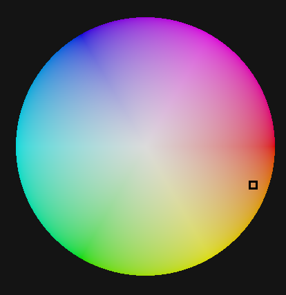
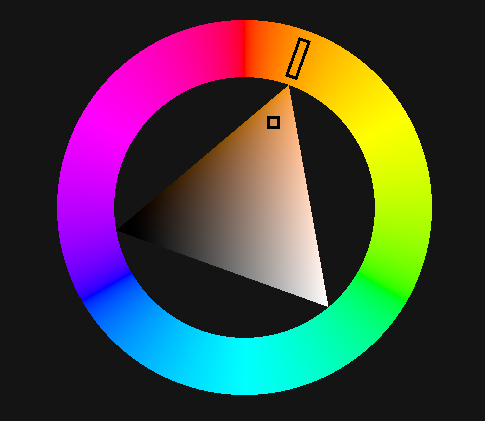
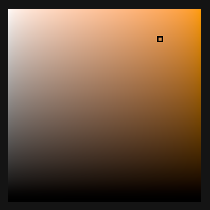
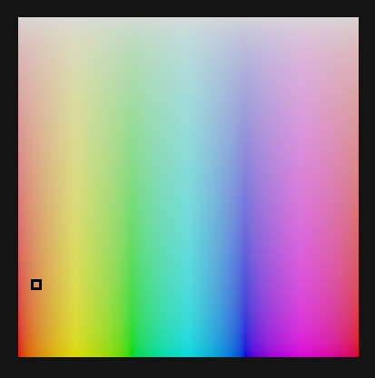
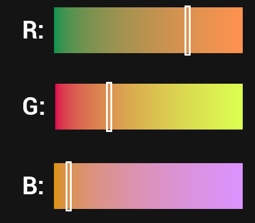
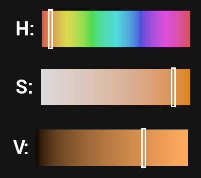

# VVAD's UE Color Widgets & Utils

Unreal Engine plugin that provides **color selection widgets** and **utility tools** for working with colors inside Unreal Engine.

## What's Inside

### Widgets
 - Color sliders (H,S,V, R,G,B)
 - Color custom gradient sliders
 - Hue wheel
 - HS Square
 - SV Square
 - Color triangle

### Functions:
 - Render gradient into texture
 - Colorspace convertations

## Installation

1. Clone repository into your project: `<Project>/Plugins/`
2. Regenerate project files 
3. Compile project  
4. Enable plugin in: `Edit → Plugins → VVAD_ColorUtilsAndWidgets`

or

1. Download needed version from releases
2. Unarchive into `<Project>/Plugins/`
3. Enable plugin in: `Edit → Plugins → VVAD_ColorUtilsAndWidgets`

## Supported Engine Versions

- Unreal Engine 4.27 (Vite)
- Unreal Engine 5.5
- Unreal Engine 5.6
- Unreal Engine 5.7  

## Screenshots
 

 

  

